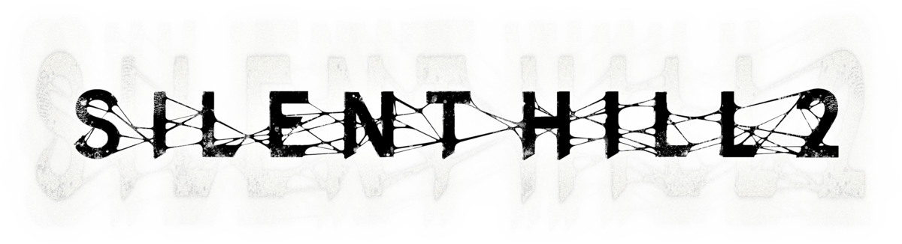

<div align=center>



</div>
<h1 align=center>Silent Hill 2 — Nintendo Switch port</h1>

<p align=center><b>v0.55</b></p>

A native Nintendo Switch port of the PC version of **Silent Hill 2** (Director's Cut / Restless Dreams), with
support for the packs of **[Silent Hill 2: Enhanced Edition](https://enhanced.townofsilenthill.com/SH2/)**.

It's not an emulator. The game's x86 executable is statically recompiled to C ahead of time and the C is compiled
for the Switch's ARM64 CPU. The Windows layer the game expects (Direct3D 8, DirectSound, DirectInput, Bink,
kernel32...) is reimplemented on top of SDL2, OpenGL and FFmpeg.

> [!NOTE]
> No game files and no prebuilt NRO are included. You need your own copy of the PC game with the Enhanced Edition
> installed, and you build the NRO from it yourself ([Building the NRO](#building-the-nro)).

## Features

- **Native code**: every function of `sh2pc.exe` runs as ARM64 code; no emulator, no Wine.
- **Widescreen**: 16:9 at 1280x720 by default, 1920x1080 for docked play, or the original 4:3 (ThirteenAG's
  WidescreenFix, ported).
- **Enhanced Edition packs**: HD textures, the EE title and save screens, the restored music, voices and sound
  effects, EE menus and fonts. The FMV pack is not supported yet.
- **Enhanced Edition fixes**: search camera on the right stick, movement on the d-pad, pause menu fix, vibration
  fixes.
- **Controller**: SH2EE's button layout with Nintendo's A/B, HD rumble following the in-game Vibration option.
- **Saving and loading**, movies with synced audio, every menu.
- **Shader cache**: shaders are compiled once and kept on the SD card, so areas only stutter the first time.
- Also builds for Linux (x86-64), which is where most of the debugging happens.

## What's new in v0.55

Everything since the first release:

- **Enhanced Edition support** ([r4lix/sh2-nx](https://github.com/r4lix/sh2-nx)): the `sh2e/` packs with a switch per
  folder (`sh2e.ini`), HD textures (EE's texture buffers), the audio pack's 89 MB sound effect bank, the EE title
  and save screen art, the title menu per language, and EE's code patches applied to the exe before recompiling
  (`tools/patch_exe.py`, `src/game/ee.c`).
- **Widescreen** with a `resolution` setting; cutscene letterboxing hidden on a wide screen (r4lix).
- **Controls**: SH2EE's layout and default bindings (no `keyconf.dat` needed), Nintendo's A/B on the Switch, HD rumble
  (r4lix), EE's controller tweaks (r4lix).
- **Crash fixed** when opening Options with a controller connected (always the case on the Switch).
- **Music going silent, starting late or looping** (for example after skipping a cutscene) fixed: lost `PulseEvent`
  pulses starved CRI's audio thread, and a resume that came before its pause parked a thread for good.
- **Saves**: "damaged folders" fixed (reads at the end of a file zeroed the buffer on the Switch), save times in
  local time, real file times (r4lix).
- **Grey transitions and save thumbnails** fixed: the front buffer is the last presented frame (r4lix).
- **Stutter** when areas or shaders load: shader program cache in `sh2-progs.bin` (r4lix).
- **Lifter**: MSVC `switch` chains no longer lose a branch (r4lix).
- **CPU**: the game's frame limiters no longer keep two cores at 100%.
- A heap quarantine against a use-after-free in the game, no power-of-two texture rounding, hidden mouse cursor,
  no safe mode after HOME (r4lix).

## How to install

1. On your PC, install Silent Hill 2 and run the [Enhanced Edition setup](https://enhanced.townofsilenthill.com/SH2/)
   with at least the **Enhanced Executable**, **Essential Files**, **Image Enhancement Pack** and **Audio Enhancement
   Pack**. The port is built for the `sh2pc.exe` it installs: 5,685,248 bytes, SHA-1
   `3201a5e1029f3ae3b77770255dcbe10360b3cd09`.
2. Build `sh2-nx.nro` from that folder ([Building the NRO](#building-the-nro)).
3. Copy everything to the SD card. With the card (or its folder) mounted on the PC:

   ```sh
   .venv/bin/python tools/make_sd.py /path/to/sd --lang en      # en, fr, de, it, es or jp
   ```

   or by hand. Your `sh2-nx` folder should look like this:

   ```text
   /switch/sh2-nx/
     sh2-nx.nro
     sh2pc.exe        (from your PC install)
     data/            (from your PC install, about 2.4 GB)
     sh2e/            (from your PC install, without sh2e/movie: about 4 GB)
     sh2e.ini         (which Enhanced Edition packs to use: docs/sh2e.ini.example)
     language.ini     (optional: SET DX_CONFIG_LANGUAGE 1 is English)
     keyconf.dat      (optional: your PC's button mapping)
   ```

   `sh2e/pic/etc` and `sh2e/menu/mc` are needed even with every pack switched off: the title and save screens are laid
   out for the Enhanced Edition's art.

4. Launch it from the homebrew menu in **title takeover** mode (hold **R** while starting an installed game) or from a
   forwarder set to a **39-bit address space**. Not from the album: applet mode does not give homebrew enough memory.

Settings, saves (`data/save`) and the shader cache are written next to the NRO.

> [!CAUTION]
> The first time you enter an area its shaders are compiled, so **it can stutter for a moment**. They are kept in
> `sh2-progs.bin` and later visits are smooth.

## Controls

<div align="center">

| Switch | Xbox (PC) | Action |
| --- | --- | --- |
| A | A | Action, confirm |
| B | B | Cancel, flashlight |
| Y | X | Run / guard |
| X | Y | Map |
| L / R | LB / RB | Cycle target |
| ZL | LT | Search mode (ready the weapon) |
| ZR | RT | Aim lock |
| + | Start | Inventory |
| − | Back | Skip / pause |
| Left stick, d-pad | Left stick, d-pad | Move |
| Right stick | Right stick | Search camera |

</div>

A confirms and B cancels, as in other Switch games, so those two sit swapped compared with an Xbox pad; every other
button is in the same place as on an Xbox pad with the Enhanced Edition. Remap them in Options > Control Options; a
`keyconf.dat` from a PC install maps the same buttons.

## Settings

`sh2e.ini`, next to the NRO ([example](docs/sh2e.ini.example)):

| Setting | Effect |
| --- | --- |
| `pic=1`, `sound=1`, `bg=1`, ... | read that folder of `data/` from `sh2e/` (the Enhanced Edition pack) |
| `movie=0` | keep it off: the FMV pack's 60 fps videos play at half speed until its frame-rate patch is ported |
| `resolution=1280x720` | the default; `1920x1080` for docked play, `960x720` for the original 4:3 |
| `hdmaps=1` | the HD map pages (their layout is off: EE's map scaling is not ported) |
| `cores=1` | every game thread on one core, a fallback if the music ever loops again |
| `log=1` | write `sh2.log` next to the NRO, for bug reports (off by default: it costs an SD card write per line). Crashes always go to `sh2-crash.log` |

## Building the NRO

You need the game (step 1 of [How to install](#how-to-install)): the code generator reads `sh2pc.exe`, applies the
Enhanced Edition patches to it and recompiles it.

Requirements: Python 3, CMake, Ninja, and for the Switch build podman (or a local devkitPro install with devkitA64,
libnx, switch-sdl2, switch-mesa, switch-ffmpeg and switch-pkg-config). For the Linux build, SDL2 and FFmpeg
development files (Fedora: `dnf install SDL2-devel ffmpeg-free-devel`).

```sh
git clone https://github.com/cutarev/sh2-nx && cd sh2-nx
python3 -m venv .venv && .venv/bin/pip install -r requirements.txt
ln -s "/path/to/Silent Hill 2" game     # the folder holding sh2pc.exe, data/ and sh2e/
tools/regen.sh                          # patches and recompiles game/sh2pc.exe into src/recomp/gen (~4 min)

tools/build-switch.sh                   # -> build/switch/sh2-nx.nro (devkitPro's container under podman)
tools/build-switch-local.sh             # the same with a local devkitPro install

cmake -S . -B build/linux -G Ninja && cmake --build build/linux    # Linux build
build/linux/sh2 game
```

## How it works

- **The game's code is translated, not emulated.** `tools/regen.sh` wraps the PE as an XBE for
  [xboxrecomp](https://github.com/sp00nznet/xboxrecomp) (patched for this port: flag joins, jump tables, x87/MMX
  corner cases, setjmp/longjmp), which turns every function into C.
- **Enhanced Edition patches.** EE patches the running game from its `d3d8.dll`; here its code byte patches are
  applied to the exe before recompiling (`tools/patch_exe.py`, each site checked against the original bytes) and its
  hooks become hand-written functions in `src/game/ee.c`. Details in [docs/ENHANCED.md](docs/ENHANCED.md).
- **The Windows layer.** Direct3D 8 runs on OpenGL 4.3 core with the shaders translated to GLSL (`src/d3d8`),
  DirectSound is a software mixer on SDL audio, DirectInput goes through SDL, Bink videos through FFmpeg, and
  kernel32, user32 and msvcr70 are in `src/win32`. `src/runtime` holds the guest memory, threads and the
  Linux/Horizon layer.

## Debugging aids (Linux)

| Variable | Effect |
| --- | --- |
| `SH2_KEYS="12:Return,30:W+5"` | scripted key presses (seconds, key, optional hold); the window is hidden and the real keyboard ignored |
| `SH2_SHOW=1` | keep the window visible during a scripted run |
| `SH2_SHOT=dir`, `SH2_SHOT_EVERY=n` | dump frames as PPM (`tools/ppm2png.py`) |
| `SH2_WAV=file` | record the audio mix (raw float32 stereo, 44.1 kHz) |
| `SH2_STATS=1` | frame rate and guest heap |
| `SH2_TRACE=1` | log every bridged Windows call (`trace=1` with `log=1` in `sh2e.ini` on the Switch) |
| `SH2_COVER=frame` | with a tracing build (`TRACE=$PWD/build/disasm/functions.json tools/regen.sh --recomp-only`), log each function the first time it runs after that frame |
| `SH2_ORACLE=va,n` | differential test of one function against Unicorn (`tools/oracle.py`) |

`tools/fuzz.py` checks the lifter's instruction semantics against Unicorn.

## Credits

- **Konami and Team Silent**: creators of Silent Hill 2. This is an unofficial, fan-made port with no affiliation.
- **[r4lix](https://github.com/r4lix/sh2-nx)** and Le Z: the Enhanced Edition support, widescreen, HD rumble, the
  shader cache and the lifter, save and front buffer fixes in v0.55.
- **[Silent Hill 2 Enhancements](https://github.com/elishacloud/Silent-Hill-2-Enhancements)** by Elisha Riedlinger and
  contributors (zlib): the patches ported in `src/game/ee.c` and `tools/patch_exe.py`.
- **[WidescreenFixesPack](https://github.com/ThirteenAG/WidescreenFixesPack)** by ThirteenAG (MIT): the widescreen fix.
- **[xboxrecomp](https://github.com/sp00nznet/xboxrecomp)** by sp00nznet: the x86 to C lifter.
- **nfsmw-nx**, the Need for Speed: Most Wanted Switch port, for the Horizon guest-memory technique.
- **[devkitPro](https://devkitpro.org) and [switchbrew](https://github.com/switchbrew/libnx)**, SDL2, FFmpeg, Mesa.

## Legal

Silent Hill is a trademark of Konami. This project is not affiliated with Konami. This repository contains no assets
or program code from the original game; users must provide their own copy. Running homebrew requires custom firmware.
